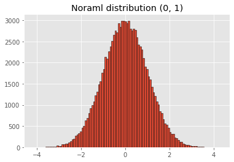

<h1>Table of Contents<span class="tocSkip"></span></h1>
<div class="toc"><ul class="toc-item"><li><span><a href="#Что-такое-Jupyter-Notebook?" data-toc-modified-id="Что-такое-Jupyter-Notebook?-1"><span class="toc-item-num">1&nbsp;&nbsp;</span>Что такое Jupyter Notebook?</a></span><ul class="toc-item"><li><span><a href="#Позволяет-писать-текст-используя-Html-и-Markdown" data-toc-modified-id="Позволяет-писать-текст-используя-Html-и-Markdown-1.1"><span class="toc-item-num">1.1&nbsp;&nbsp;</span>Позволяет писать текст используя Html и Markdown</a></span></li><li><span><a href="#Позволяет-писать-и-выполнять-код" data-toc-modified-id="Позволяет-писать-и-выполнять-код-1.2"><span class="toc-item-num">1.2&nbsp;&nbsp;</span>Позволяет писать и выполнять код</a></span></li><li><span><a href="#Позволяет-устанавливать-Python-библиотеки" data-toc-modified-id="Позволяет-устанавливать-Python-библиотеки-1.3"><span class="toc-item-num">1.3&nbsp;&nbsp;</span>Позволяет устанавливать Python библиотеки</a></span></li><li><span><a href="#Позволяет-использовать-утилиты-OS" data-toc-modified-id="Позволяет-использовать-утилиты-OS-1.4"><span class="toc-item-num">1.4&nbsp;&nbsp;</span>Позволяет использовать утилиты OS</a></span></li></ul></li></ul></div>

# Что такое Jupyter Notebook?


Jupyter Notebook - это редактор кода Python, специально разработанный для анализа данных. Он похож на R Studio.
Важное отличие Jupyter Notebooks - то, что он открывается в браузере!


## Позволяет писать текст используя Html и Markdown

## Позволяет писать и выполнять код


```python
print('This is code')

import numpy as np
import matplotlib.pyplot as plt
plt.style.use('ggplot')

plt.hist(np.random.normal(size=100000), edgecolor='k', bins='scott');
plt.title('Noraml distribution (0, 1)')
plt.savefig('normal.png', dpi=200, bbox_inches='tight')
```

    This is code
    


    

    


```python
2900/100 * 90
```


    2610.0


## Позволяет устанавливать Python библиотеки


```python
# !conda install -c conda-forge -c bioconda gseapy

# # or 

# !pip install gseapy
```

## Позволяет использовать утилиты OS


```python
# !wget 
# !rm
# !mv
# !ls
# !unzip
# ... any program 
```
