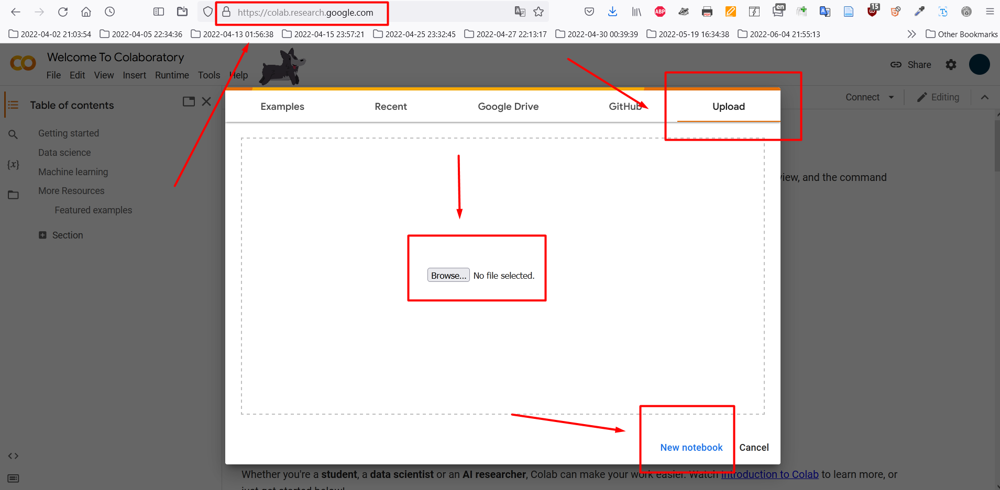
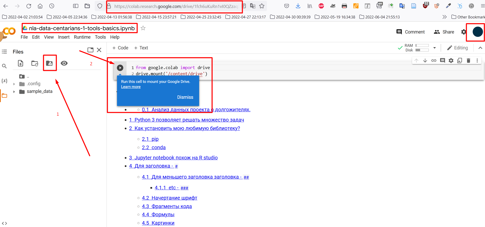
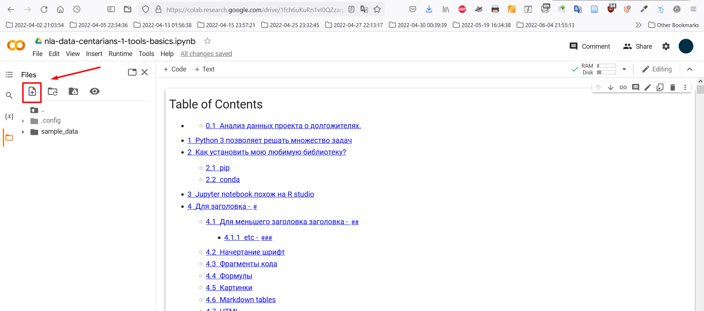

<h1>Table of Contents<span class="tocSkip"></span></h1>
<div class="toc"><ul class="toc-item"><li><span><a href="#У-меня-есть-аккаунт-Google.-Как-я-могу-использовать-Google-Collab?" data-toc-modified-id="У-меня-есть-аккаунт-Google.-Как-я-могу-использовать-Google-Collab?-1"><span class="toc-item-num">1&nbsp;&nbsp;</span>У меня есть аккаунт Google. Как я могу использовать Google Collab?</a></span></li><li><span><a href="#Кaк-подключить-Google-Disc-для-чтения-с-него-файлов-в-Google-Collab?" data-toc-modified-id="Кaк-подключить-Google-Disc-для-чтения-с-него-файлов-в-Google-Collab?-2"><span class="toc-item-num">2&nbsp;&nbsp;</span>Кaк подключить Google Disc для чтения с него файлов в Google Collab?</a></span></li><li><span><a href="#Кaк-временно-загрузить-данные-в-Google-Collab?" data-toc-modified-id="Кaк-временно-загрузить-данные-в-Google-Collab?-3"><span class="toc-item-num">3&nbsp;&nbsp;</span>Кaк временно загрузить данные в Google Collab?</a></span></li></ul></div>

# У меня есть аккаунт Google. Как я могу использовать Google Collab?

0. Войдите в свою учётную запись Google
1. Чтобы воспользоваться Google Collab, перейдите на [страницу сервиса](https://colab.research.google.com/).
2. Загрузите файл .ipynb или создайте новый блокнот.
3. Подключитесь к среде выполнения (происходит автоматически).
4. Подключите Google Диск или загрузите временные файлы для работы



# Кaк подключить Google Disc для чтения с него файлов в Google Collab?

1. Нажимте на кнопку в левой части экрана (1)
2. Проиграёте ячейку с кодом (2)



# Кaк временно загрузить данные в Google Collab?

1. Нажимте на кнопку в левой части экрана (1)




```python

```
