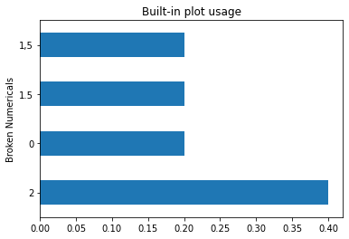
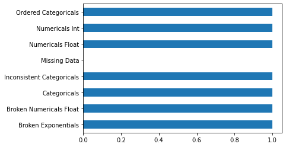

<h1>Table of Contents<span class="tocSkip"></span></h1>
<div class="toc"><ul class="toc-item"><li><span><a href="#Модуль-OS" data-toc-modified-id="Модуль-OS-1"><span class="toc-item-num">1&nbsp;&nbsp;</span>Модуль OS</a></span><ul class="toc-item"><li><span><a href="#Получить-список-из-файлов-в-папке---os.listdir()" data-toc-modified-id="Получить-список-из-файлов-в-папке---os.listdir()-1.1"><span class="toc-item-num">1.1&nbsp;&nbsp;</span>Получить список из файлов в папке - <code>os.listdir()</code></a></span></li><li><span><a href="#Проверить-существует-ли-файл/путь---os.path.exists()" data-toc-modified-id="Проверить-существует-ли-файл/путь---os.path.exists()-1.2"><span class="toc-item-num">1.2&nbsp;&nbsp;</span>Проверить существует ли файл/путь - <code>os.path.exists()</code></a></span></li><li><span><a href="#Посмотреть/изменить-переменные-среды---os.environ[]" data-toc-modified-id="Посмотреть/изменить-переменные-среды---os.environ[]-1.3"><span class="toc-item-num">1.3&nbsp;&nbsp;</span>Посмотреть/изменить переменные среды - <code>os.environ[]</code></a></span></li></ul></li><li><span><a href="#Pandas---для-работы-с-данными" data-toc-modified-id="Pandas---для-работы-с-данными-2"><span class="toc-item-num">2&nbsp;&nbsp;</span>Pandas - для работы с данными</a></span></li><li><span><a href="#Загрузите-библиотеку,-чтобы-воспользоваться-её-функциями" data-toc-modified-id="Загрузите-библиотеку,-чтобы-воспользоваться-её-функциями-3"><span class="toc-item-num">3&nbsp;&nbsp;</span>Загрузите библиотеку, чтобы воспользоваться её функциями</a></span><ul class="toc-item"><li><span><a href="#import-pandas-as-pd" data-toc-modified-id="import-pandas-as-pd-3.1"><span class="toc-item-num">3.1&nbsp;&nbsp;</span><code>import pandas as pd</code></a></span></li></ul></li><li><span><a href="#Cоздать-DataFrame-вручную---pd.DataFrame()" data-toc-modified-id="Cоздать-DataFrame-вручную---pd.DataFrame()-4"><span class="toc-item-num">4&nbsp;&nbsp;</span>Cоздать DataFrame вручную - <code>pd.DataFrame()</code></a></span></li><li><span><a href="#Показать-DataFrame" data-toc-modified-id="Показать-DataFrame-5"><span class="toc-item-num">5&nbsp;&nbsp;</span>Показать DataFrame</a></span><ul class="toc-item"><li><span><a href="#Показать-первые-N-строк---data.head(N)" data-toc-modified-id="Показать-первые-N-строк---data.head(N)-5.1"><span class="toc-item-num">5.1&nbsp;&nbsp;</span>Показать первые N строк - <code>data.head(N)</code></a></span></li><li><span><a href="#Показать-последние-N-строк---data.tail(N)" data-toc-modified-id="Показать-последние-N-строк---data.tail(N)-5.2"><span class="toc-item-num">5.2&nbsp;&nbsp;</span>Показать последние N строк - <code>data.tail(N)</code></a></span></li></ul></li><li><span><a href="#Сохранить-DataFrame-в-файл---data.to_csv()/data.to_excel()" data-toc-modified-id="Сохранить-DataFrame-в-файл---data.to_csv()/data.to_excel()-6"><span class="toc-item-num">6&nbsp;&nbsp;</span>Сохранить DataFrame в файл - <code>data.to_csv()/data.to_excel()</code></a></span></li><li><span><a href="#Загрузить-Dataframe-из-файла---pd.read_csv()/pd.read_excel()" data-toc-modified-id="Загрузить-Dataframe-из-файла---pd.read_csv()/pd.read_excel()-7"><span class="toc-item-num">7&nbsp;&nbsp;</span>Загрузить Dataframe из файла - <code>pd.read_csv()/pd.read_excel()</code></a></span><ul class="toc-item"><li><span><a href="#Exel" data-toc-modified-id="Exel-7.1"><span class="toc-item-num">7.1&nbsp;&nbsp;</span>Exel</a></span><ul class="toc-item"><li><span><a href="#Загрузить-определенные-данные" data-toc-modified-id="Загрузить-определенные-данные-7.1.1"><span class="toc-item-num">7.1.1&nbsp;&nbsp;</span>Загрузить определенные данные</a></span></li></ul></li><li><span><a href="#CSV" data-toc-modified-id="CSV-7.2"><span class="toc-item-num">7.2&nbsp;&nbsp;</span>CSV</a></span></li><li><span><a href="#TSV" data-toc-modified-id="TSV-7.3"><span class="toc-item-num">7.3&nbsp;&nbsp;</span>TSV</a></span></li><li><span><a href="#Parquet" data-toc-modified-id="Parquet-7.4"><span class="toc-item-num">7.4&nbsp;&nbsp;</span>Parquet</a></span></li><li><span><a href="#Json" data-toc-modified-id="Json-7.5"><span class="toc-item-num">7.5&nbsp;&nbsp;</span>Json</a></span></li><li><span><a href="#Указать-&quot;код&quot;-пропущенных-значений-при-чтении" data-toc-modified-id="Указать-&quot;код&quot;-пропущенных-значений-при-чтении-7.6"><span class="toc-item-num">7.6&nbsp;&nbsp;</span>Указать "код" пропущенных значений при чтении</a></span></li><li><span><a href="#Удалить-колоноку---data.drop(col_name,-axis=1)" data-toc-modified-id="Удалить-колоноку---data.drop(col_name,-axis=1)-7.7"><span class="toc-item-num">7.7&nbsp;&nbsp;</span>Удалить колоноку - <code>data.drop(col_name, axis=1)</code></a></span></li><li><span><a href="#Индексация---data.iloc[row_index,-col_index]" data-toc-modified-id="Индексация---data.iloc[row_index,-col_index]-7.8"><span class="toc-item-num">7.8&nbsp;&nbsp;</span>Индексация - <code>data.iloc[row_index, col_index]</code></a></span><ul class="toc-item"><li><span><a href="#Сделать-колонку-индексом---data.set_index()" data-toc-modified-id="Сделать-колонку-индексом---data.set_index()-7.8.1"><span class="toc-item-num">7.8.1&nbsp;&nbsp;</span>Сделать колонку индексом - <code>data.set_index()</code></a></span></li><li><span><a href="#Сбросить-колонку-индекса---data.reset_index(drop=True)" data-toc-modified-id="Сбросить-колонку-индекса---data.reset_index(drop=True)-7.8.2"><span class="toc-item-num">7.8.2&nbsp;&nbsp;</span>Сбросить колонку индекса - <code>data.reset_index(drop=True)</code></a></span></li><li><span><a href="#Поменять-порядок-колонок-списком---data[col_list]" data-toc-modified-id="Поменять-порядок-колонок-списком---data[col_list]-7.8.3"><span class="toc-item-num">7.8.3&nbsp;&nbsp;</span>Поменять порядок колонок списком - <code>data[col_list]</code></a></span></li></ul></li><li><span><a href="#Частоиспользуемые-функции" data-toc-modified-id="Частоиспользуемые-функции-7.9"><span class="toc-item-num">7.9&nbsp;&nbsp;</span>Частоиспользуемые функции</a></span><ul class="toc-item"><li><span><a href="#Вывести-summay-o-данных---data.describe()/data.info()" data-toc-modified-id="Вывести-summay-o-данных---data.describe()/data.info()-7.9.1"><span class="toc-item-num">7.9.1&nbsp;&nbsp;</span>Вывести summay o данных - <code>data.describe()/data.info()</code></a></span></li><li><span><a href="#Получить-индекс-и-название-колонок---data.index/data.columns" data-toc-modified-id="Получить-индекс-и-название-колонок---data.index/data.columns-7.9.2"><span class="toc-item-num">7.9.2&nbsp;&nbsp;</span>Получить индекс и название колонок - <code>data.index/data.columns</code></a></span></li><li><span><a href="#Вывести-типы-данных---data.dtypes" data-toc-modified-id="Вывести-типы-данных---data.dtypes-7.9.3"><span class="toc-item-num">7.9.3&nbsp;&nbsp;</span>Вывести типы данных - <code>data.dtypes</code></a></span></li><li><span><a href="#Изменть-тип-данных---data[col_name].astype()" data-toc-modified-id="Изменть-тип-данных---data[col_name].astype()-7.9.4"><span class="toc-item-num">7.9.4&nbsp;&nbsp;</span>Изменть тип данных - <code>data[col_name].astype()</code></a></span></li><li><span><a href="#Фильтровать-по-типу-данных---data.select_dtypes()" data-toc-modified-id="Фильтровать-по-типу-данных---data.select_dtypes()-7.9.5"><span class="toc-item-num">7.9.5&nbsp;&nbsp;</span>Фильтровать по типу данных - <code>data.select_dtypes()</code></a></span></li><li><span><a href="#Фильтровать-по-названию---'data.filter()'" data-toc-modified-id="Фильтровать-по-названию---'data.filter()'-7.9.6"><span class="toc-item-num">7.9.6&nbsp;&nbsp;</span>Фильтровать по названию - 'data.filter()'</a></span></li><li><span><a href="#Подсчёт-встречаемости---data.value_counts(normalize=True)" data-toc-modified-id="Подсчёт-встречаемости---data.value_counts(normalize=True)-7.9.7"><span class="toc-item-num">7.9.7&nbsp;&nbsp;</span>Подсчёт встречаемости - <code>data.value_counts(normalize=True)</code></a></span></li><li><span><a href="#Сгруппировать-данные---data.groupby()" data-toc-modified-id="Сгруппировать-данные---data.groupby()-7.9.8"><span class="toc-item-num">7.9.8&nbsp;&nbsp;</span>Сгруппировать данные - <code>data.groupby()</code></a></span></li><li><span><a href="#Применить-функцию---data.apply()" data-toc-modified-id="Применить-функцию---data.apply()-7.9.9"><span class="toc-item-num">7.9.9&nbsp;&nbsp;</span>Применить функцию - <code>data.apply()</code></a></span></li><li><span><a href="#Создать-копию-data.copy()" data-toc-modified-id="Создать-копию-data.copy()-7.9.10"><span class="toc-item-num">7.9.10&nbsp;&nbsp;</span>Создать копию <code>data.copy()</code></a></span></li><li><span><a href="#Вывести-уникальные-значения---data[col_name].unique()" data-toc-modified-id="Вывести-уникальные-значения---data[col_name].unique()-7.9.11"><span class="toc-item-num">7.9.11&nbsp;&nbsp;</span>Вывести уникальные значения - <code>data[col_name].unique()</code></a></span></li><li><span><a href="#Заменть-переменные-data.map()" data-toc-modified-id="Заменть-переменные-data.map()-7.9.12"><span class="toc-item-num">7.9.12&nbsp;&nbsp;</span>Заменть переменные <code>data.map()</code></a></span></li><li><span><a href="#Показвать,-подсчитать,-заполнить-или-удалить-пропущенные-значения---data.notna()/data.fillna()/data.dropna()" data-toc-modified-id="Показвать,-подсчитать,-заполнить-или-удалить-пропущенные-значения---data.notna()/data.fillna()/data.dropna()-7.9.13"><span class="toc-item-num">7.9.13&nbsp;&nbsp;</span>Показвать, подсчитать, заполнить или удалить пропущенные значения - <code>data.notna()/data.fillna()/data.dropna()</code></a></span></li><li><span><a href="#Логические-условия" data-toc-modified-id="Логические-условия-7.9.14"><span class="toc-item-num">7.9.14&nbsp;&nbsp;</span>Логические условия</a></span><ul class="toc-item"><li><span><a href="#and---&amp;" data-toc-modified-id="and---&amp;-7.9.14.1"><span class="toc-item-num">7.9.14.1&nbsp;&nbsp;</span>and - <code>&amp;</code></a></span></li><li><span><a href="#or--|" data-toc-modified-id="or--|-7.9.14.2"><span class="toc-item-num">7.9.14.2&nbsp;&nbsp;</span>or -<code>|</code></a></span></li><li><span><a href="#xor---^" data-toc-modified-id="xor---^-7.9.14.3"><span class="toc-item-num">7.9.14.3&nbsp;&nbsp;</span>xor - <code>^</code></a></span></li><li><span><a href="#equal---==" data-toc-modified-id="equal---==-7.9.14.4"><span class="toc-item-num">7.9.14.4&nbsp;&nbsp;</span>equal - <code>==</code></a></span></li><li><span><a href="#not-equal---!=" data-toc-modified-id="not-equal---!=-7.9.14.5"><span class="toc-item-num">7.9.14.5&nbsp;&nbsp;</span>not equal - <code>!=</code></a></span></li><li><span><a href="#data[col_name].isin()" data-toc-modified-id="data[col_name].isin()-7.9.14.6"><span class="toc-item-num">7.9.14.6&nbsp;&nbsp;</span><code>data[col_name].isin()</code></a></span></li><li><span><a href="#data[col_name].str.contains()" data-toc-modified-id="data[col_name].str.contains()-7.9.14.7"><span class="toc-item-num">7.9.14.7&nbsp;&nbsp;</span><code>data[col_name].str.contains()</code></a></span></li><li><span><a href="#Запросы-data.query()" data-toc-modified-id="Запросы-data.query()-7.9.14.8"><span class="toc-item-num">7.9.14.8&nbsp;&nbsp;</span>Запросы <code>data.query()</code></a></span></li></ul></li><li><span><a href="#'data.rename()'" data-toc-modified-id="'data.rename()'-7.9.15"><span class="toc-item-num">7.9.15&nbsp;&nbsp;</span>'data.rename()'</a></span></li><li><span><a href="#'pd.merge'" data-toc-modified-id="'pd.merge'-7.9.16"><span class="toc-item-num">7.9.16&nbsp;&nbsp;</span>'pd.merge'</a></span></li></ul></li><li><span><a href="#Чтение-батчами---pd.read_csv(chunk_size=N)" data-toc-modified-id="Чтение-батчами---pd.read_csv(chunk_size=N)-7.10"><span class="toc-item-num">7.10&nbsp;&nbsp;</span>Чтение батчами - <code>pd.read_csv(chunk_size=N)</code></a></span></li><li><span><a href="#Запись-батчами---chunk.to_csv(mode='a',-header=None)" data-toc-modified-id="Запись-батчами---chunk.to_csv(mode='a',-header=None)-7.11"><span class="toc-item-num">7.11&nbsp;&nbsp;</span>Запись батчами - <code>chunk.to_csv(mode='a', header=None)</code></a></span></li></ul></li><li><span><a href="#Pandasparallel" data-toc-modified-id="Pandasparallel-8"><span class="toc-item-num">8&nbsp;&nbsp;</span><a href="https://github.com/nalepae/pandarallel?ysclid=ldb9qrkk1h261074156" target="_blank">Pandasparallel</a></a></span></li></ul></div>


```python
import warnings

warnings.filterwarnings('ignore')
```

# Модуль OS

Модуль `OS` - это модуль из стандартной библиотеки `Python` (его не нужно устанавливать), он полезен для получения списка файлов, проверки наличия файлов и изменения переменных окружения.

## Получить список из файлов в папке - `os.listdir()`
## Проверить существует ли файл/путь - `os.path.exists()`
## Посмотреть/изменить переменные среды - `os.environ[]`


```python
import os

os.listdir() # Аналогично %ls или !ls, но возвращает список
```


    ['.ipynb_checkpoints', '0-pandas.ipynb']


```python
os.path.exists('data.csv')
```


    False


```python
assert os.path.exists('data.csv')
```


    ---------------------------------------------------------------------------

    AssertionError                            Traceback (most recent call last)

    <ipython-input-4-8ed7c2fcd79c> in <module>
    ----> 1 assert os.path.exists('data.csv')
    

    AssertionError: 


# Pandas - для работы с данными

[Pandas](https://pandas.pydata.org/) - самая популярная библиотека для работы с данными.

Чтобы установить `pandas` и __большинство других библиотек__, используйте команду `!pip install pandas

# Загрузите библиотеку, чтобы воспользоваться её функциями 

## `import pandas as pd`


```python
# pd - это псевдоним (сокращение) для Pandas, он ничего не означает.
# но доступ к функциям pandas будет осуществляться через него
import pandas as pd # для работы с данными
import numpy as np # для математики
```

# Cоздать DataFrame вручную - `pd.DataFrame()`


```python
# Пример создания Dataframe вручную
data = pd.DataFrame()

data['Numericals Int'] = list(range(5))
data['Numericals Float'] = np.linspace(0, 1, 5)
data['Ordered Categoricals'] = ['F', 'C', 'B', 'A', 'A+']
data['Categoricals'] = ['Akerke', 'Ali', 'Alisher', 'Ablay', 'Adilet']
data['Broken Numericals Float'] = ['1.5', '1,5', '2', '2', '0']
data['Broken Numericals Float'] = ['1.5', '1,5', '2', '2', '0']
data['Broken Exponentials'] = ['1E-2', '1e-2', '1E-10', ' 1E-2', '1e2']
data['Inconsistent Categoricals'] = ['Kazakh', 'kazakh', ' Kazakh', 'KAZAKH', 'china']
data['Missing Data'] = [np.nan, '', '-1', '?', 'N/A']
```

# Показать DataFrame


```python
data # display(data)
```


<div>
<style scoped>
    .dataframe tbody tr th:only-of-type {
        vertical-align: middle;
    }

    .dataframe tbody tr th {
        vertical-align: top;
    }

    .dataframe thead th {
        text-align: right;
    }
</style>
<table border="1" class="dataframe">
  <thead>
    <tr style="text-align: right;">
      <th></th>
      <th>Numericals Int</th>
      <th>Numericals Float</th>
      <th>Ordered Categoricals</th>
      <th>Categoricals</th>
      <th>Broken Numericals Float</th>
      <th>Broken Exponentials</th>
      <th>Inconsistent Categoricals</th>
      <th>Missing Data</th>
    </tr>
  </thead>
  <tbody>
    <tr>
      <th>0</th>
      <td>0</td>
      <td>0.00</td>
      <td>F</td>
      <td>Akerke</td>
      <td>1.5</td>
      <td>1E-2</td>
      <td>Kazakh</td>
      <td>NaN</td>
    </tr>
    <tr>
      <th>1</th>
      <td>1</td>
      <td>0.25</td>
      <td>C</td>
      <td>Ali</td>
      <td>1,5</td>
      <td>1e-2</td>
      <td>kazakh</td>
      <td></td>
    </tr>
    <tr>
      <th>2</th>
      <td>2</td>
      <td>0.50</td>
      <td>B</td>
      <td>Alisher</td>
      <td>2</td>
      <td>1E-10</td>
      <td>Kazakh</td>
      <td>-1</td>
    </tr>
    <tr>
      <th>3</th>
      <td>3</td>
      <td>0.75</td>
      <td>A</td>
      <td>Ablay</td>
      <td>2</td>
      <td>1E-2</td>
      <td>KAZAKH</td>
      <td>?</td>
    </tr>
    <tr>
      <th>4</th>
      <td>4</td>
      <td>1.00</td>
      <td>A+</td>
      <td>Adilet</td>
      <td>0</td>
      <td>1e2</td>
      <td>china</td>
      <td>N/A</td>
    </tr>
  </tbody>
</table>
</div>


## Показать первые N строк - `data.head(N)`


```python
data.head(3)
```


<div>
<style scoped>
    .dataframe tbody tr th:only-of-type {
        vertical-align: middle;
    }

    .dataframe tbody tr th {
        vertical-align: top;
    }

    .dataframe thead th {
        text-align: right;
    }
</style>
<table border="1" class="dataframe">
  <thead>
    <tr style="text-align: right;">
      <th></th>
      <th>Numericals Int</th>
      <th>Numericals Float</th>
      <th>Ordered Categoricals</th>
      <th>Categoricals</th>
      <th>Broken Numericals Float</th>
      <th>Broken Exponentials</th>
      <th>Inconsistent Categoricals</th>
      <th>Missing Data</th>
    </tr>
  </thead>
  <tbody>
    <tr>
      <th>0</th>
      <td>0</td>
      <td>0.00</td>
      <td>F</td>
      <td>Akerke</td>
      <td>1.5</td>
      <td>1E-2</td>
      <td>Kazakh</td>
      <td>NaN</td>
    </tr>
    <tr>
      <th>1</th>
      <td>1</td>
      <td>0.25</td>
      <td>C</td>
      <td>Ali</td>
      <td>1,5</td>
      <td>1e-2</td>
      <td>kazakh</td>
      <td></td>
    </tr>
    <tr>
      <th>2</th>
      <td>2</td>
      <td>0.50</td>
      <td>B</td>
      <td>Alisher</td>
      <td>2</td>
      <td>1E-10</td>
      <td>Kazakh</td>
      <td>-1</td>
    </tr>
  </tbody>
</table>
</div>


## Показать последние N строк - `data.tail(N)`


```python
data.tail(2)
```


<div>
<style scoped>
    .dataframe tbody tr th:only-of-type {
        vertical-align: middle;
    }

    .dataframe tbody tr th {
        vertical-align: top;
    }

    .dataframe thead th {
        text-align: right;
    }
</style>
<table border="1" class="dataframe">
  <thead>
    <tr style="text-align: right;">
      <th></th>
      <th>Numericals Int</th>
      <th>Numericals Float</th>
      <th>Ordered Categoricals</th>
      <th>Categoricals</th>
      <th>Broken Numericals Float</th>
      <th>Broken Exponentials</th>
      <th>Inconsistent Categoricals</th>
      <th>Missing Data</th>
    </tr>
  </thead>
  <tbody>
    <tr>
      <th>3</th>
      <td>3</td>
      <td>0.75</td>
      <td>A</td>
      <td>Ablay</td>
      <td>2</td>
      <td>1E-2</td>
      <td>KAZAKH</td>
      <td>?</td>
    </tr>
    <tr>
      <th>4</th>
      <td>4</td>
      <td>1.00</td>
      <td>A+</td>
      <td>Adilet</td>
      <td>0</td>
      <td>1e2</td>
      <td>china</td>
      <td>N/A</td>
    </tr>
  </tbody>
</table>
</div>


# Сохранить DataFrame в файл - `data.to_csv()/data.to_excel()`

Для сохранения DataFrame - воспользуйтесь функциями вида `data.to_csv()`

```python
# Сохранить с индексом
data.to_csv('data.csv')

# Сохранить без индексом
data.to_csv('data.csv', index=False)
```


```python
data.index.name = 'Index'

data.to_excel('data.xlsx')

data.to_csv('data.csv') # data.to_csv('data.csv', index=False)
data.to_csv('data.tsv', sep = '\t')

data.to_parquet('data.pq')

data.to_json('data.json')
```

# Загрузить Dataframe из файла - `pd.read_csv()/pd.read_excel()`

## Exel


```python
pd.read_excel('data.xlsx', index_col='Index') # sheet_name=0
```


<div>
<style scoped>
    .dataframe tbody tr th:only-of-type {
        vertical-align: middle;
    }

    .dataframe tbody tr th {
        vertical-align: top;
    }

    .dataframe thead th {
        text-align: right;
    }
</style>
<table border="1" class="dataframe">
  <thead>
    <tr style="text-align: right;">
      <th></th>
      <th>Numericals Int</th>
      <th>Numericals Float</th>
      <th>Ordered Categoricals</th>
      <th>Categoricals</th>
      <th>Broken Numericals Float</th>
      <th>Broken Exponentials</th>
      <th>Inconsistent Categoricals</th>
      <th>Missing Data</th>
    </tr>
    <tr>
      <th>Index</th>
      <th></th>
      <th></th>
      <th></th>
      <th></th>
      <th></th>
      <th></th>
      <th></th>
      <th></th>
    </tr>
  </thead>
  <tbody>
    <tr>
      <th>0</th>
      <td>0</td>
      <td>0.00</td>
      <td>F</td>
      <td>Akerke</td>
      <td>1.5</td>
      <td>1.000000e-02</td>
      <td>Kazakh</td>
      <td>NaN</td>
    </tr>
    <tr>
      <th>1</th>
      <td>1</td>
      <td>0.25</td>
      <td>C</td>
      <td>Ali</td>
      <td>1,5</td>
      <td>1.000000e-02</td>
      <td>kazakh</td>
      <td>NaN</td>
    </tr>
    <tr>
      <th>2</th>
      <td>2</td>
      <td>0.50</td>
      <td>B</td>
      <td>Alisher</td>
      <td>2</td>
      <td>1.000000e-10</td>
      <td>Kazakh</td>
      <td>-1</td>
    </tr>
    <tr>
      <th>3</th>
      <td>3</td>
      <td>0.75</td>
      <td>A</td>
      <td>Ablay</td>
      <td>2</td>
      <td>1.000000e-02</td>
      <td>KAZAKH</td>
      <td>?</td>
    </tr>
    <tr>
      <th>4</th>
      <td>4</td>
      <td>1.00</td>
      <td>A+</td>
      <td>Adilet</td>
      <td>0</td>
      <td>1.000000e+02</td>
      <td>china</td>
      <td>NaN</td>
    </tr>
  </tbody>
</table>
</div>


### Загрузить определенные данные


```python
pd.read_excel('data.xlsx', usecols=['Numericals Int', 'Numericals Float'])
```


<div>
<style scoped>
    .dataframe tbody tr th:only-of-type {
        vertical-align: middle;
    }

    .dataframe tbody tr th {
        vertical-align: top;
    }

    .dataframe thead th {
        text-align: right;
    }
</style>
<table border="1" class="dataframe">
  <thead>
    <tr style="text-align: right;">
      <th></th>
      <th>Numericals Int</th>
      <th>Numericals Float</th>
    </tr>
  </thead>
  <tbody>
    <tr>
      <th>0</th>
      <td>0</td>
      <td>0.00</td>
    </tr>
    <tr>
      <th>1</th>
      <td>1</td>
      <td>0.25</td>
    </tr>
    <tr>
      <th>2</th>
      <td>2</td>
      <td>0.50</td>
    </tr>
    <tr>
      <th>3</th>
      <td>3</td>
      <td>0.75</td>
    </tr>
    <tr>
      <th>4</th>
      <td>4</td>
      <td>1.00</td>
    </tr>
  </tbody>
</table>
</div>


## CSV


```python
pd.read_csv('data.csv', index_col='Index')
```


<div>
<style scoped>
    .dataframe tbody tr th:only-of-type {
        vertical-align: middle;
    }

    .dataframe tbody tr th {
        vertical-align: top;
    }

    .dataframe thead th {
        text-align: right;
    }
</style>
<table border="1" class="dataframe">
  <thead>
    <tr style="text-align: right;">
      <th></th>
      <th>Numericals Int</th>
      <th>Numericals Float</th>
      <th>Ordered Categoricals</th>
      <th>Categoricals</th>
      <th>Broken Numericals Float</th>
      <th>Broken Exponentials</th>
      <th>Inconsistent Categoricals</th>
      <th>Missing Data</th>
    </tr>
    <tr>
      <th>Index</th>
      <th></th>
      <th></th>
      <th></th>
      <th></th>
      <th></th>
      <th></th>
      <th></th>
      <th></th>
    </tr>
  </thead>
  <tbody>
    <tr>
      <th>0</th>
      <td>0</td>
      <td>0.00</td>
      <td>F</td>
      <td>Akerke</td>
      <td>1.5</td>
      <td>1.000000e-02</td>
      <td>Kazakh</td>
      <td>NaN</td>
    </tr>
    <tr>
      <th>1</th>
      <td>1</td>
      <td>0.25</td>
      <td>C</td>
      <td>Ali</td>
      <td>1,5</td>
      <td>1.000000e-02</td>
      <td>kazakh</td>
      <td>NaN</td>
    </tr>
    <tr>
      <th>2</th>
      <td>2</td>
      <td>0.50</td>
      <td>B</td>
      <td>Alisher</td>
      <td>2</td>
      <td>1.000000e-10</td>
      <td>Kazakh</td>
      <td>-1</td>
    </tr>
    <tr>
      <th>3</th>
      <td>3</td>
      <td>0.75</td>
      <td>A</td>
      <td>Ablay</td>
      <td>2</td>
      <td>1.000000e-02</td>
      <td>KAZAKH</td>
      <td>?</td>
    </tr>
    <tr>
      <th>4</th>
      <td>4</td>
      <td>1.00</td>
      <td>A+</td>
      <td>Adilet</td>
      <td>0</td>
      <td>1.000000e+02</td>
      <td>china</td>
      <td>NaN</td>
    </tr>
  </tbody>
</table>
</div>


## TSV


```python
pd.read_csv('data.tsv', sep = '\t', index_col='Index')
```


<div>
<style scoped>
    .dataframe tbody tr th:only-of-type {
        vertical-align: middle;
    }

    .dataframe tbody tr th {
        vertical-align: top;
    }

    .dataframe thead th {
        text-align: right;
    }
</style>
<table border="1" class="dataframe">
  <thead>
    <tr style="text-align: right;">
      <th></th>
      <th>Numericals Int</th>
      <th>Numericals Float</th>
      <th>Ordered Categoricals</th>
      <th>Categoricals</th>
      <th>Broken Numericals Float</th>
      <th>Broken Exponentials</th>
      <th>Inconsistent Categoricals</th>
      <th>Missing Data</th>
    </tr>
    <tr>
      <th>Index</th>
      <th></th>
      <th></th>
      <th></th>
      <th></th>
      <th></th>
      <th></th>
      <th></th>
      <th></th>
    </tr>
  </thead>
  <tbody>
    <tr>
      <th>0</th>
      <td>0</td>
      <td>0.00</td>
      <td>F</td>
      <td>Akerke</td>
      <td>1.5</td>
      <td>1.000000e-02</td>
      <td>Kazakh</td>
      <td>NaN</td>
    </tr>
    <tr>
      <th>1</th>
      <td>1</td>
      <td>0.25</td>
      <td>C</td>
      <td>Ali</td>
      <td>1,5</td>
      <td>1.000000e-02</td>
      <td>kazakh</td>
      <td>NaN</td>
    </tr>
    <tr>
      <th>2</th>
      <td>2</td>
      <td>0.50</td>
      <td>B</td>
      <td>Alisher</td>
      <td>2</td>
      <td>1.000000e-10</td>
      <td>Kazakh</td>
      <td>-1</td>
    </tr>
    <tr>
      <th>3</th>
      <td>3</td>
      <td>0.75</td>
      <td>A</td>
      <td>Ablay</td>
      <td>2</td>
      <td>1.000000e-02</td>
      <td>KAZAKH</td>
      <td>?</td>
    </tr>
    <tr>
      <th>4</th>
      <td>4</td>
      <td>1.00</td>
      <td>A+</td>
      <td>Adilet</td>
      <td>0</td>
      <td>1.000000e+02</td>
      <td>china</td>
      <td>NaN</td>
    </tr>
  </tbody>
</table>
</div>


## Parquet


```python
pd.read_parquet('data.pq')
```


<div>
<style scoped>
    .dataframe tbody tr th:only-of-type {
        vertical-align: middle;
    }

    .dataframe tbody tr th {
        vertical-align: top;
    }

    .dataframe thead th {
        text-align: right;
    }
</style>
<table border="1" class="dataframe">
  <thead>
    <tr style="text-align: right;">
      <th></th>
      <th>Numericals Int</th>
      <th>Numericals Float</th>
      <th>Ordered Categoricals</th>
      <th>Categoricals</th>
      <th>Broken Numericals Float</th>
      <th>Broken Exponentials</th>
      <th>Inconsistent Categoricals</th>
      <th>Missing Data</th>
    </tr>
    <tr>
      <th>Index</th>
      <th></th>
      <th></th>
      <th></th>
      <th></th>
      <th></th>
      <th></th>
      <th></th>
      <th></th>
    </tr>
  </thead>
  <tbody>
    <tr>
      <th>0</th>
      <td>0</td>
      <td>0.00</td>
      <td>F</td>
      <td>Akerke</td>
      <td>1.5</td>
      <td>1E-2</td>
      <td>Kazakh</td>
      <td>None</td>
    </tr>
    <tr>
      <th>1</th>
      <td>1</td>
      <td>0.25</td>
      <td>C</td>
      <td>Ali</td>
      <td>1,5</td>
      <td>1e-2</td>
      <td>kazakh</td>
      <td></td>
    </tr>
    <tr>
      <th>2</th>
      <td>2</td>
      <td>0.50</td>
      <td>B</td>
      <td>Alisher</td>
      <td>2</td>
      <td>1E-10</td>
      <td>Kazakh</td>
      <td>-1</td>
    </tr>
    <tr>
      <th>3</th>
      <td>3</td>
      <td>0.75</td>
      <td>A</td>
      <td>Ablay</td>
      <td>2</td>
      <td>1E-2</td>
      <td>KAZAKH</td>
      <td>?</td>
    </tr>
    <tr>
      <th>4</th>
      <td>4</td>
      <td>1.00</td>
      <td>A+</td>
      <td>Adilet</td>
      <td>0</td>
      <td>1e2</td>
      <td>china</td>
      <td>N/A</td>
    </tr>
  </tbody>
</table>
</div>


## Json


```python
pd.read_json('data.json') # lines=True
```


<div>
<style scoped>
    .dataframe tbody tr th:only-of-type {
        vertical-align: middle;
    }

    .dataframe tbody tr th {
        vertical-align: top;
    }

    .dataframe thead th {
        text-align: right;
    }
</style>
<table border="1" class="dataframe">
  <thead>
    <tr style="text-align: right;">
      <th></th>
      <th>Numericals Int</th>
      <th>Numericals Float</th>
      <th>Ordered Categoricals</th>
      <th>Categoricals</th>
      <th>Broken Numericals Float</th>
      <th>Broken Exponentials</th>
      <th>Inconsistent Categoricals</th>
      <th>Missing Data</th>
    </tr>
  </thead>
  <tbody>
    <tr>
      <th>0</th>
      <td>0</td>
      <td>0.00</td>
      <td>F</td>
      <td>Akerke</td>
      <td>1.5</td>
      <td>1.000000e-02</td>
      <td>Kazakh</td>
      <td>None</td>
    </tr>
    <tr>
      <th>1</th>
      <td>1</td>
      <td>0.25</td>
      <td>C</td>
      <td>Ali</td>
      <td>1,5</td>
      <td>1.000000e-02</td>
      <td>kazakh</td>
      <td></td>
    </tr>
    <tr>
      <th>2</th>
      <td>2</td>
      <td>0.50</td>
      <td>B</td>
      <td>Alisher</td>
      <td>2</td>
      <td>1.000000e-10</td>
      <td>Kazakh</td>
      <td>-1</td>
    </tr>
    <tr>
      <th>3</th>
      <td>3</td>
      <td>0.75</td>
      <td>A</td>
      <td>Ablay</td>
      <td>2</td>
      <td>1.000000e-02</td>
      <td>KAZAKH</td>
      <td>?</td>
    </tr>
    <tr>
      <th>4</th>
      <td>4</td>
      <td>1.00</td>
      <td>A+</td>
      <td>Adilet</td>
      <td>0</td>
      <td>1.000000e+02</td>
      <td>china</td>
      <td>N/A</td>
    </tr>
  </tbody>
</table>
</div>


## Указать "код" пропущенных значений при чтении


```python
data = pd.read_csv('data.csv', na_values=['N/A', np.nan, '', '-1', '-', '?'])
data
```


<div>
<style scoped>
    .dataframe tbody tr th:only-of-type {
        vertical-align: middle;
    }

    .dataframe tbody tr th {
        vertical-align: top;
    }

    .dataframe thead th {
        text-align: right;
    }
</style>
<table border="1" class="dataframe">
  <thead>
    <tr style="text-align: right;">
      <th></th>
      <th>Index</th>
      <th>Numericals Int</th>
      <th>Numericals Float</th>
      <th>Ordered Categoricals</th>
      <th>Categoricals</th>
      <th>Broken Numericals Float</th>
      <th>Broken Exponentials</th>
      <th>Inconsistent Categoricals</th>
      <th>Missing Data</th>
    </tr>
  </thead>
  <tbody>
    <tr>
      <th>0</th>
      <td>0</td>
      <td>0</td>
      <td>0.00</td>
      <td>F</td>
      <td>Akerke</td>
      <td>1.5</td>
      <td>1.000000e-02</td>
      <td>Kazakh</td>
      <td>NaN</td>
    </tr>
    <tr>
      <th>1</th>
      <td>1</td>
      <td>1</td>
      <td>0.25</td>
      <td>C</td>
      <td>Ali</td>
      <td>1,5</td>
      <td>1.000000e-02</td>
      <td>kazakh</td>
      <td>NaN</td>
    </tr>
    <tr>
      <th>2</th>
      <td>2</td>
      <td>2</td>
      <td>0.50</td>
      <td>B</td>
      <td>Alisher</td>
      <td>2</td>
      <td>1.000000e-10</td>
      <td>Kazakh</td>
      <td>NaN</td>
    </tr>
    <tr>
      <th>3</th>
      <td>3</td>
      <td>3</td>
      <td>0.75</td>
      <td>A</td>
      <td>Ablay</td>
      <td>2</td>
      <td>1.000000e-02</td>
      <td>KAZAKH</td>
      <td>NaN</td>
    </tr>
    <tr>
      <th>4</th>
      <td>4</td>
      <td>4</td>
      <td>1.00</td>
      <td>A+</td>
      <td>Adilet</td>
      <td>0</td>
      <td>1.000000e+02</td>
      <td>china</td>
      <td>NaN</td>
    </tr>
  </tbody>
</table>
</div>


## Удалить колоноку - `data.drop(col_name, axis=1)`


```python
# data = data.drop('Numericals Int', axis=1)
# data = data.drop('Numericals Int', axis=1, inplace=True)
data.drop('Numericals Int', axis=1)
```


<div>
<style scoped>
    .dataframe tbody tr th:only-of-type {
        vertical-align: middle;
    }

    .dataframe tbody tr th {
        vertical-align: top;
    }

    .dataframe thead th {
        text-align: right;
    }
</style>
<table border="1" class="dataframe">
  <thead>
    <tr style="text-align: right;">
      <th></th>
      <th>Index</th>
      <th>Numericals Float</th>
      <th>Ordered Categoricals</th>
      <th>Categoricals</th>
      <th>Broken Numericals Float</th>
      <th>Broken Exponentials</th>
      <th>Inconsistent Categoricals</th>
      <th>Missing Data</th>
    </tr>
  </thead>
  <tbody>
    <tr>
      <th>0</th>
      <td>0</td>
      <td>0.00</td>
      <td>F</td>
      <td>Akerke</td>
      <td>1.5</td>
      <td>1.000000e-02</td>
      <td>Kazakh</td>
      <td>NaN</td>
    </tr>
    <tr>
      <th>1</th>
      <td>1</td>
      <td>0.25</td>
      <td>C</td>
      <td>Ali</td>
      <td>1,5</td>
      <td>1.000000e-02</td>
      <td>kazakh</td>
      <td>NaN</td>
    </tr>
    <tr>
      <th>2</th>
      <td>2</td>
      <td>0.50</td>
      <td>B</td>
      <td>Alisher</td>
      <td>2</td>
      <td>1.000000e-10</td>
      <td>Kazakh</td>
      <td>NaN</td>
    </tr>
    <tr>
      <th>3</th>
      <td>3</td>
      <td>0.75</td>
      <td>A</td>
      <td>Ablay</td>
      <td>2</td>
      <td>1.000000e-02</td>
      <td>KAZAKH</td>
      <td>NaN</td>
    </tr>
    <tr>
      <th>4</th>
      <td>4</td>
      <td>1.00</td>
      <td>A+</td>
      <td>Adilet</td>
      <td>0</td>
      <td>1.000000e+02</td>
      <td>china</td>
      <td>NaN</td>
    </tr>
  </tbody>
</table>
</div>


## Индексация - `data.iloc[row_index, col_index]`


```python
data.iloc[2, 2]
```


    0.5


```python
data.iloc[2, 3]
```


    'B'


```python
data.iloc[:2, 2]
```


    0    0.00
    1    0.25
    Name: Numericals Float, dtype: float64


```python
data.iloc[:2, :2]
```


<div>
<style scoped>
    .dataframe tbody tr th:only-of-type {
        vertical-align: middle;
    }

    .dataframe tbody tr th {
        vertical-align: top;
    }

    .dataframe thead th {
        text-align: right;
    }
</style>
<table border="1" class="dataframe">
  <thead>
    <tr style="text-align: right;">
      <th></th>
      <th>Index</th>
      <th>Numericals Int</th>
    </tr>
  </thead>
  <tbody>
    <tr>
      <th>0</th>
      <td>0</td>
      <td>0</td>
    </tr>
    <tr>
      <th>1</th>
      <td>1</td>
      <td>1</td>
    </tr>
  </tbody>
</table>
</div>


```python
data.loc[:, ('Numericals Float', 'Numericals Int')]
```


<div>
<style scoped>
    .dataframe tbody tr th:only-of-type {
        vertical-align: middle;
    }

    .dataframe tbody tr th {
        vertical-align: top;
    }

    .dataframe thead th {
        text-align: right;
    }
</style>
<table border="1" class="dataframe">
  <thead>
    <tr style="text-align: right;">
      <th></th>
      <th>Numericals Float</th>
      <th>Numericals Int</th>
    </tr>
  </thead>
  <tbody>
    <tr>
      <th>0</th>
      <td>0.00</td>
      <td>0</td>
    </tr>
    <tr>
      <th>1</th>
      <td>0.25</td>
      <td>1</td>
    </tr>
    <tr>
      <th>2</th>
      <td>0.50</td>
      <td>2</td>
    </tr>
    <tr>
      <th>3</th>
      <td>0.75</td>
      <td>3</td>
    </tr>
    <tr>
      <th>4</th>
      <td>1.00</td>
      <td>4</td>
    </tr>
  </tbody>
</table>
</div>


### Сделать колонку индексом - `data.set_index()`


```python
data = data.set_index('Categoricals')
data
```


<div>
<style scoped>
    .dataframe tbody tr th:only-of-type {
        vertical-align: middle;
    }

    .dataframe tbody tr th {
        vertical-align: top;
    }

    .dataframe thead th {
        text-align: right;
    }
</style>
<table border="1" class="dataframe">
  <thead>
    <tr style="text-align: right;">
      <th></th>
      <th>Index</th>
      <th>Numericals Int</th>
      <th>Numericals Float</th>
      <th>Ordered Categoricals</th>
      <th>Broken Numericals Float</th>
      <th>Broken Exponentials</th>
      <th>Inconsistent Categoricals</th>
      <th>Missing Data</th>
    </tr>
    <tr>
      <th>Categoricals</th>
      <th></th>
      <th></th>
      <th></th>
      <th></th>
      <th></th>
      <th></th>
      <th></th>
      <th></th>
    </tr>
  </thead>
  <tbody>
    <tr>
      <th>Akerke</th>
      <td>0</td>
      <td>0</td>
      <td>0.00</td>
      <td>F</td>
      <td>1.5</td>
      <td>1.000000e-02</td>
      <td>Kazakh</td>
      <td>NaN</td>
    </tr>
    <tr>
      <th>Ali</th>
      <td>1</td>
      <td>1</td>
      <td>0.25</td>
      <td>C</td>
      <td>1,5</td>
      <td>1.000000e-02</td>
      <td>kazakh</td>
      <td>NaN</td>
    </tr>
    <tr>
      <th>Alisher</th>
      <td>2</td>
      <td>2</td>
      <td>0.50</td>
      <td>B</td>
      <td>2</td>
      <td>1.000000e-10</td>
      <td>Kazakh</td>
      <td>NaN</td>
    </tr>
    <tr>
      <th>Ablay</th>
      <td>3</td>
      <td>3</td>
      <td>0.75</td>
      <td>A</td>
      <td>2</td>
      <td>1.000000e-02</td>
      <td>KAZAKH</td>
      <td>NaN</td>
    </tr>
    <tr>
      <th>Adilet</th>
      <td>4</td>
      <td>4</td>
      <td>1.00</td>
      <td>A+</td>
      <td>0</td>
      <td>1.000000e+02</td>
      <td>china</td>
      <td>NaN</td>
    </tr>
  </tbody>
</table>
</div>


```python
data.loc[('Akerke', 'Ablay'), ('Numericals Float', 'Numericals Int')]
```


<div>
<style scoped>
    .dataframe tbody tr th:only-of-type {
        vertical-align: middle;
    }

    .dataframe tbody tr th {
        vertical-align: top;
    }

    .dataframe thead th {
        text-align: right;
    }
</style>
<table border="1" class="dataframe">
  <thead>
    <tr style="text-align: right;">
      <th></th>
      <th>Numericals Float</th>
      <th>Numericals Int</th>
    </tr>
    <tr>
      <th>Categoricals</th>
      <th></th>
      <th></th>
    </tr>
  </thead>
  <tbody>
    <tr>
      <th>Akerke</th>
      <td>0.00</td>
      <td>0</td>
    </tr>
    <tr>
      <th>Ablay</th>
      <td>0.75</td>
      <td>3</td>
    </tr>
  </tbody>
</table>
</div>


### Сбросить колонку индекса - `data.reset_index(drop=True)`


```python
data.reset_index(drop=True)
```


<div>
<style scoped>
    .dataframe tbody tr th:only-of-type {
        vertical-align: middle;
    }

    .dataframe tbody tr th {
        vertical-align: top;
    }

    .dataframe thead th {
        text-align: right;
    }
</style>
<table border="1" class="dataframe">
  <thead>
    <tr style="text-align: right;">
      <th></th>
      <th>Index</th>
      <th>Numericals Int</th>
      <th>Numericals Float</th>
      <th>Ordered Categoricals</th>
      <th>Broken Numericals Float</th>
      <th>Broken Exponentials</th>
      <th>Inconsistent Categoricals</th>
      <th>Missing Data</th>
    </tr>
  </thead>
  <tbody>
    <tr>
      <th>0</th>
      <td>0</td>
      <td>0</td>
      <td>0.00</td>
      <td>F</td>
      <td>1.5</td>
      <td>1.000000e-02</td>
      <td>Kazakh</td>
      <td>NaN</td>
    </tr>
    <tr>
      <th>1</th>
      <td>1</td>
      <td>1</td>
      <td>0.25</td>
      <td>C</td>
      <td>1,5</td>
      <td>1.000000e-02</td>
      <td>kazakh</td>
      <td>NaN</td>
    </tr>
    <tr>
      <th>2</th>
      <td>2</td>
      <td>2</td>
      <td>0.50</td>
      <td>B</td>
      <td>2</td>
      <td>1.000000e-10</td>
      <td>Kazakh</td>
      <td>NaN</td>
    </tr>
    <tr>
      <th>3</th>
      <td>3</td>
      <td>3</td>
      <td>0.75</td>
      <td>A</td>
      <td>2</td>
      <td>1.000000e-02</td>
      <td>KAZAKH</td>
      <td>NaN</td>
    </tr>
    <tr>
      <th>4</th>
      <td>4</td>
      <td>4</td>
      <td>1.00</td>
      <td>A+</td>
      <td>0</td>
      <td>1.000000e+02</td>
      <td>china</td>
      <td>NaN</td>
    </tr>
  </tbody>
</table>
</div>


```python
data = data.reset_index(drop=False)
```

### Поменять порядок колонок списком - `data[col_list]`


```python
col_list = list(data)
```


```python
col_list.sort()
```


```python
col_list
```


    ['Broken Exponentials',
     'Broken Numericals Float',
     'Categoricals',
     'Inconsistent Categoricals',
     'Index',
     'Missing Data',
     'Numericals Float',
     'Numericals Int',
     'Ordered Categoricals']


```python
col_list.remove('Index')# col_list.pop(index)
```


```python
col_list
```


    ['Broken Exponentials',
     'Broken Numericals Float',
     'Categoricals',
     'Inconsistent Categoricals',
     'Missing Data',
     'Numericals Float',
     'Numericals Int',
     'Ordered Categoricals']


```python
data = data[col_list]
data.head()
```


<div>
<style scoped>
    .dataframe tbody tr th:only-of-type {
        vertical-align: middle;
    }

    .dataframe tbody tr th {
        vertical-align: top;
    }

    .dataframe thead th {
        text-align: right;
    }
</style>
<table border="1" class="dataframe">
  <thead>
    <tr style="text-align: right;">
      <th></th>
      <th>Broken Exponentials</th>
      <th>Broken Numericals Float</th>
      <th>Categoricals</th>
      <th>Inconsistent Categoricals</th>
      <th>Missing Data</th>
      <th>Numericals Float</th>
      <th>Numericals Int</th>
      <th>Ordered Categoricals</th>
    </tr>
  </thead>
  <tbody>
    <tr>
      <th>0</th>
      <td>1.000000e-02</td>
      <td>1.5</td>
      <td>Akerke</td>
      <td>Kazakh</td>
      <td>NaN</td>
      <td>0.00</td>
      <td>0</td>
      <td>F</td>
    </tr>
    <tr>
      <th>1</th>
      <td>1.000000e-02</td>
      <td>1,5</td>
      <td>Ali</td>
      <td>kazakh</td>
      <td>NaN</td>
      <td>0.25</td>
      <td>1</td>
      <td>C</td>
    </tr>
    <tr>
      <th>2</th>
      <td>1.000000e-10</td>
      <td>2</td>
      <td>Alisher</td>
      <td>Kazakh</td>
      <td>NaN</td>
      <td>0.50</td>
      <td>2</td>
      <td>B</td>
    </tr>
    <tr>
      <th>3</th>
      <td>1.000000e-02</td>
      <td>2</td>
      <td>Ablay</td>
      <td>KAZAKH</td>
      <td>NaN</td>
      <td>0.75</td>
      <td>3</td>
      <td>A</td>
    </tr>
    <tr>
      <th>4</th>
      <td>1.000000e+02</td>
      <td>0</td>
      <td>Adilet</td>
      <td>china</td>
      <td>NaN</td>
      <td>1.00</td>
      <td>4</td>
      <td>A+</td>
    </tr>
  </tbody>
</table>
</div>


## Частоиспользуемые функции

### Вывести summay o данных - `data.describe()/data.info()`


```python
data.describe()
```


<div>
<style scoped>
    .dataframe tbody tr th:only-of-type {
        vertical-align: middle;
    }

    .dataframe tbody tr th {
        vertical-align: top;
    }

    .dataframe thead th {
        text-align: right;
    }
</style>
<table border="1" class="dataframe">
  <thead>
    <tr style="text-align: right;">
      <th></th>
      <th>Broken Exponentials</th>
      <th>Missing Data</th>
      <th>Numericals Float</th>
      <th>Numericals Int</th>
    </tr>
  </thead>
  <tbody>
    <tr>
      <th>count</th>
      <td>5.000000e+00</td>
      <td>0.0</td>
      <td>5.000000</td>
      <td>5.000000</td>
    </tr>
    <tr>
      <th>mean</th>
      <td>2.000600e+01</td>
      <td>NaN</td>
      <td>0.500000</td>
      <td>2.000000</td>
    </tr>
    <tr>
      <th>std</th>
      <td>4.471801e+01</td>
      <td>NaN</td>
      <td>0.395285</td>
      <td>1.581139</td>
    </tr>
    <tr>
      <th>min</th>
      <td>1.000000e-10</td>
      <td>NaN</td>
      <td>0.000000</td>
      <td>0.000000</td>
    </tr>
    <tr>
      <th>25%</th>
      <td>1.000000e-02</td>
      <td>NaN</td>
      <td>0.250000</td>
      <td>1.000000</td>
    </tr>
    <tr>
      <th>50%</th>
      <td>1.000000e-02</td>
      <td>NaN</td>
      <td>0.500000</td>
      <td>2.000000</td>
    </tr>
    <tr>
      <th>75%</th>
      <td>1.000000e-02</td>
      <td>NaN</td>
      <td>0.750000</td>
      <td>3.000000</td>
    </tr>
    <tr>
      <th>max</th>
      <td>1.000000e+02</td>
      <td>NaN</td>
      <td>1.000000</td>
      <td>4.000000</td>
    </tr>
  </tbody>
</table>
</div>


```python
data.info()
```

    <class 'pandas.core.frame.DataFrame'>
    RangeIndex: 5 entries, 0 to 4
    Data columns (total 8 columns):
     #   Column                     Non-Null Count  Dtype  
    ---  ------                     --------------  -----  
     0   Broken Exponentials        5 non-null      float64
     1   Broken Numericals Float    5 non-null      object 
     2   Categoricals               5 non-null      object 
     3   Inconsistent Categoricals  5 non-null      object 
     4   Missing Data               0 non-null      float64
     5   Numericals Float           5 non-null      float64
     6   Numericals Int             5 non-null      int64  
     7   Ordered Categoricals       5 non-null      object 
    dtypes: float64(3), int64(1), object(4)
    memory usage: 448.0+ bytes
    

### Получить индекс и название колонок - `data.index/data.columns`


```python
data.index
```


    RangeIndex(start=0, stop=5, step=1)


```python
data.columns
```


    Index(['Broken Exponentials', 'Broken Numericals Float', 'Categoricals',
           'Inconsistent Categoricals', 'Missing Data', 'Numericals Float',
           'Numericals Int', 'Ordered Categoricals'],
          dtype='object')


```python
list(data)
```


    ['Broken Exponentials',
     'Broken Numericals Float',
     'Categoricals',
     'Inconsistent Categoricals',
     'Missing Data',
     'Numericals Float',
     'Numericals Int',
     'Ordered Categoricals']


### Вывести типы данных - `data.dtypes`


```python
data.dtypes
```


    Broken Exponentials          float64
    Broken Numericals Float       object
    Categoricals                  object
    Inconsistent Categoricals     object
    Missing Data                 float64
    Numericals Float             float64
    Numericals Int                 int64
    Ordered Categoricals          object
    dtype: object


### Изменть тип данных - `data[col_name].astype()`


```python
data['Categoricals'] = data['Categoricals'].astype('category')

data['Numericals Int'] = data['Numericals Int'].astype('str')

data['Numericals Int'] = data['Numericals Int'].astype(int)

data['Numericals Int'] = data['Numericals Int'].astype(np.int16)
data['Numericals Int'] = data['Numericals Int'].astype(np.int32)
data['Numericals Int'] = data['Numericals Int'].astype(np.int64)

data['Numericals Int'] = data['Numericals Int'].astype(float)

data['Numericals Int'] = data['Numericals Int'].astype(np.float16)
data['Numericals Int'] = data['Numericals Int'].astype(np.float32)
data['Numericals Int'] = data['Numericals Int'].astype(np.float64)
```


```python
data.dtypes
```


    Broken Exponentials           float64
    Broken Numericals Float        object
    Categoricals                 category
    Inconsistent Categoricals      object
    Missing Data                  float64
    Numericals Float              float64
    Numericals Int                float64
    Ordered Categoricals           object
    dtype: object


### Фильтровать по типу данных - `data.select_dtypes()`


```python
data.select_dtypes(exclude=np.number)
```


<div>
<style scoped>
    .dataframe tbody tr th:only-of-type {
        vertical-align: middle;
    }

    .dataframe tbody tr th {
        vertical-align: top;
    }

    .dataframe thead th {
        text-align: right;
    }
</style>
<table border="1" class="dataframe">
  <thead>
    <tr style="text-align: right;">
      <th></th>
      <th>Broken Numericals Float</th>
      <th>Categoricals</th>
      <th>Inconsistent Categoricals</th>
      <th>Ordered Categoricals</th>
    </tr>
  </thead>
  <tbody>
    <tr>
      <th>0</th>
      <td>1.5</td>
      <td>Akerke</td>
      <td>Kazakh</td>
      <td>F</td>
    </tr>
    <tr>
      <th>1</th>
      <td>1,5</td>
      <td>Ali</td>
      <td>kazakh</td>
      <td>C</td>
    </tr>
    <tr>
      <th>2</th>
      <td>2</td>
      <td>Alisher</td>
      <td>Kazakh</td>
      <td>B</td>
    </tr>
    <tr>
      <th>3</th>
      <td>2</td>
      <td>Ablay</td>
      <td>KAZAKH</td>
      <td>A</td>
    </tr>
    <tr>
      <th>4</th>
      <td>0</td>
      <td>Adilet</td>
      <td>china</td>
      <td>A+</td>
    </tr>
  </tbody>
</table>
</div>


```python
data.select_dtypes(include=np.number)
```


<div>
<style scoped>
    .dataframe tbody tr th:only-of-type {
        vertical-align: middle;
    }

    .dataframe tbody tr th {
        vertical-align: top;
    }

    .dataframe thead th {
        text-align: right;
    }
</style>
<table border="1" class="dataframe">
  <thead>
    <tr style="text-align: right;">
      <th></th>
      <th>Broken Exponentials</th>
      <th>Missing Data</th>
      <th>Numericals Float</th>
      <th>Numericals Int</th>
    </tr>
  </thead>
  <tbody>
    <tr>
      <th>0</th>
      <td>1.000000e-02</td>
      <td>NaN</td>
      <td>0.00</td>
      <td>0.0</td>
    </tr>
    <tr>
      <th>1</th>
      <td>1.000000e-02</td>
      <td>NaN</td>
      <td>0.25</td>
      <td>1.0</td>
    </tr>
    <tr>
      <th>2</th>
      <td>1.000000e-10</td>
      <td>NaN</td>
      <td>0.50</td>
      <td>2.0</td>
    </tr>
    <tr>
      <th>3</th>
      <td>1.000000e-02</td>
      <td>NaN</td>
      <td>0.75</td>
      <td>3.0</td>
    </tr>
    <tr>
      <th>4</th>
      <td>1.000000e+02</td>
      <td>NaN</td>
      <td>1.00</td>
      <td>4.0</td>
    </tr>
  </tbody>
</table>
</div>


### Фильтровать по названию - 'data.filter()'


```python
data.filter(like='Broken')
```


<div>
<style scoped>
    .dataframe tbody tr th:only-of-type {
        vertical-align: middle;
    }

    .dataframe tbody tr th {
        vertical-align: top;
    }

    .dataframe thead th {
        text-align: right;
    }
</style>
<table border="1" class="dataframe">
  <thead>
    <tr style="text-align: right;">
      <th></th>
      <th>Broken Exponentials</th>
      <th>Broken Numericals Float</th>
    </tr>
  </thead>
  <tbody>
    <tr>
      <th>0</th>
      <td>1.000000e-02</td>
      <td>1.5</td>
    </tr>
    <tr>
      <th>1</th>
      <td>1.000000e-02</td>
      <td>1,5</td>
    </tr>
    <tr>
      <th>2</th>
      <td>1.000000e-10</td>
      <td>2</td>
    </tr>
    <tr>
      <th>3</th>
      <td>1.000000e-02</td>
      <td>2</td>
    </tr>
    <tr>
      <th>4</th>
      <td>1.000000e+02</td>
      <td>0</td>
    </tr>
  </tbody>
</table>
</div>


```python
data.filter(regex='^Broken')
```


<div>
<style scoped>
    .dataframe tbody tr th:only-of-type {
        vertical-align: middle;
    }

    .dataframe tbody tr th {
        vertical-align: top;
    }

    .dataframe thead th {
        text-align: right;
    }
</style>
<table border="1" class="dataframe">
  <thead>
    <tr style="text-align: right;">
      <th></th>
      <th>Broken Exponentials</th>
      <th>Broken Numericals Float</th>
    </tr>
  </thead>
  <tbody>
    <tr>
      <th>0</th>
      <td>1.000000e-02</td>
      <td>1.5</td>
    </tr>
    <tr>
      <th>1</th>
      <td>1.000000e-02</td>
      <td>1,5</td>
    </tr>
    <tr>
      <th>2</th>
      <td>1.000000e-10</td>
      <td>2</td>
    </tr>
    <tr>
      <th>3</th>
      <td>1.000000e-02</td>
      <td>2</td>
    </tr>
    <tr>
      <th>4</th>
      <td>1.000000e+02</td>
      <td>0</td>
    </tr>
  </tbody>
</table>
</div>


### Подсчёт встречаемости - `data.value_counts(normalize=True)`


```python
data.value_counts(normalize=True)
```


    Series([], dtype: float64)


```python
data['Broken Numericals Float'].value_counts(normalize=True)
```


    2      0.4
    0      0.2
    1.5    0.2
    1,5    0.2
    Name: Broken Numericals Float, dtype: float64


```python
data['Broken Numericals Float'].value_counts(normalize=False)
```


    2      2
    0      1
    1.5    1
    1,5    1
    Name: Broken Numericals Float, dtype: int64


```python
data['Broken Numericals Float'].value_counts(normalize=True).plot.barh(xlabel='Broken Numericals', ylabel='%',title='Built-in plot usage');
```


    

    


```python
data['Broken Numericals Float'].value_counts(normalize=True).\
    plot.barh(xlabel='Broken Numericals', ylabel='%',title='Built-in plot usage');
```


    

    


###  Сгруппировать данные - `data.groupby()`


```python
data.groupby(['Broken Numericals Float'])['Numericals Int'].mean()
```


    Broken Numericals Float
    0      4.0
    1,5    1.0
    1.5    0.0
    2      2.5
    Name: Numericals Int, dtype: float64


```python
data.groupby(['Broken Numericals Float'])[['Numericals Int']].mean()
```


<div>
<style scoped>
    .dataframe tbody tr th:only-of-type {
        vertical-align: middle;
    }

    .dataframe tbody tr th {
        vertical-align: top;
    }

    .dataframe thead th {
        text-align: right;
    }
</style>
<table border="1" class="dataframe">
  <thead>
    <tr style="text-align: right;">
      <th></th>
      <th>Numericals Int</th>
    </tr>
    <tr>
      <th>Broken Numericals Float</th>
      <th></th>
    </tr>
  </thead>
  <tbody>
    <tr>
      <th>0</th>
      <td>4.0</td>
    </tr>
    <tr>
      <th>1,5</th>
      <td>1.0</td>
    </tr>
    <tr>
      <th>1.5</th>
      <td>0.0</td>
    </tr>
    <tr>
      <th>2</th>
      <td>2.5</td>
    </tr>
  </tbody>
</table>
</div>


### Применить функцию - `data.apply()`


```python
data['Broken Numericals Float'] = data['Broken Numericals Float'].apply(lambda x: str(x).replace(',', '.'))
```


```python
data.groupby(['Broken Numericals Float'])['Numericals Int'].mean()
```


    Broken Numericals Float
    0      4.0
    1.5    0.5
    2      2.5
    Name: Numericals Int, dtype: float64


### Создать копию `data.copy()`


```python
data_backup = data.copy(deep=True)
```

### Вывести уникальные значения - `data[col_name].unique()`


```python
data['Inconsistent Categoricals'].unique()
```


    array(['Kazakh', 'kazakh', ' Kazakh', 'KAZAKH', 'china'], dtype=object)


```python
data['Inconsistent Categoricals'].nunique()
```


    5


###  Заменть переменные `data.map()`


```python
broken_categoricals_map = {'Kazakh': 'kazakh',
                           'kazakh': 'kazakh',
                           ' Kazakh': 'kazakh',
                           'KAZAKH': 'kazakh',
                           'china': 'chinese'}
```


```python
data['Inconsistent Categoricals'].map(broken_categoricals_map)
```


    0     kazakh
    1     kazakh
    2     kazakh
    3     kazakh
    4    chinese
    Name: Inconsistent Categoricals, dtype: object


```python
data['Inconsistent Categoricals'].apply(lambda x: str(x).lower().strip())
```


    0    kazakh
    1    kazakh
    2    kazakh
    3    kazakh
    4     china
    Name: Inconsistent Categoricals, dtype: object


```python
data['Inconsistent Categoricals'] = data['Inconsistent Categoricals'].map(broken_categoricals_map)
```

### Показвать, подсчитать, заполнить или удалить пропущенные значения - `data.notna()/data.fillna()/data.dropna()`


```python
data.isna().sum()
```


    Broken Exponentials          0
    Broken Numericals Float      0
    Categoricals                 0
    Inconsistent Categoricals    0
    Missing Data                 5
    Numericals Float             0
    Numericals Int               0
    Ordered Categoricals         0
    dtype: int64


```python
data.notna().mean().plot.barh()
```


    <AxesSubplot:>


    

    


```python
data.dropna()
```


<div>
<style scoped>
    .dataframe tbody tr th:only-of-type {
        vertical-align: middle;
    }

    .dataframe tbody tr th {
        vertical-align: top;
    }

    .dataframe thead th {
        text-align: right;
    }
</style>
<table border="1" class="dataframe">
  <thead>
    <tr style="text-align: right;">
      <th></th>
      <th>Broken Exponentials</th>
      <th>Broken Numericals Float</th>
      <th>Categoricals</th>
      <th>Inconsistent Categoricals</th>
      <th>Missing Data</th>
      <th>Numericals Float</th>
      <th>Numericals Int</th>
      <th>Ordered Categoricals</th>
    </tr>
  </thead>
  <tbody>
  </tbody>
</table>
</div>


```python
data.dropna(subset=['Missing Data'])
```


<div>
<style scoped>
    .dataframe tbody tr th:only-of-type {
        vertical-align: middle;
    }

    .dataframe tbody tr th {
        vertical-align: top;
    }

    .dataframe thead th {
        text-align: right;
    }
</style>
<table border="1" class="dataframe">
  <thead>
    <tr style="text-align: right;">
      <th></th>
      <th>Broken Exponentials</th>
      <th>Broken Numericals Float</th>
      <th>Categoricals</th>
      <th>Inconsistent Categoricals</th>
      <th>Missing Data</th>
      <th>Numericals Float</th>
      <th>Numericals Int</th>
      <th>Ordered Categoricals</th>
    </tr>
  </thead>
  <tbody>
  </tbody>
</table>
</div>


```python
data['Missing Data'].fillna(-1)# method ='ffill', value = {'col_name_1' : 0, 'col_name_2' : 'unknown'}
```


    0   -1.0
    1   -1.0
    2   -1.0
    3   -1.0
    4   -1.0
    Name: Missing Data, dtype: float64


```python
data.drop('Missing Data', axis=1, inplace=True)
```

### Логические условия

#### and - `&`
#### or -` |`
#### xor - `^`
#### equal - `==`
#### not equal - `!=`
#### `data[col_name].isin()`
#### `data[col_name].str.contains()`
#### Запросы `data.query()`


```python
data[data.Categoricals == 'Akerke']
```


<div>
<style scoped>
    .dataframe tbody tr th:only-of-type {
        vertical-align: middle;
    }

    .dataframe tbody tr th {
        vertical-align: top;
    }

    .dataframe thead th {
        text-align: right;
    }
</style>
<table border="1" class="dataframe">
  <thead>
    <tr style="text-align: right;">
      <th></th>
      <th>Broken Exponentials</th>
      <th>Broken Numericals Float</th>
      <th>Categoricals</th>
      <th>Inconsistent Categoricals</th>
      <th>Numericals Float</th>
      <th>Numericals Int</th>
      <th>Ordered Categoricals</th>
    </tr>
  </thead>
  <tbody>
    <tr>
      <th>0</th>
      <td>0.01</td>
      <td>1.5</td>
      <td>Akerke</td>
      <td>kazakh</td>
      <td>0.0</td>
      <td>0.0</td>
      <td>F</td>
    </tr>
  </tbody>
</table>
</div>


```python
data[data.Categoricals != 'Akerke']
```


<div>
<style scoped>
    .dataframe tbody tr th:only-of-type {
        vertical-align: middle;
    }

    .dataframe tbody tr th {
        vertical-align: top;
    }

    .dataframe thead th {
        text-align: right;
    }
</style>
<table border="1" class="dataframe">
  <thead>
    <tr style="text-align: right;">
      <th></th>
      <th>Broken Exponentials</th>
      <th>Broken Numericals Float</th>
      <th>Categoricals</th>
      <th>Inconsistent Categoricals</th>
      <th>Numericals Float</th>
      <th>Numericals Int</th>
      <th>Ordered Categoricals</th>
    </tr>
  </thead>
  <tbody>
    <tr>
      <th>1</th>
      <td>1.000000e-02</td>
      <td>1.5</td>
      <td>Ali</td>
      <td>kazakh</td>
      <td>0.25</td>
      <td>1.0</td>
      <td>C</td>
    </tr>
    <tr>
      <th>2</th>
      <td>1.000000e-10</td>
      <td>2</td>
      <td>Alisher</td>
      <td>kazakh</td>
      <td>0.50</td>
      <td>2.0</td>
      <td>B</td>
    </tr>
    <tr>
      <th>3</th>
      <td>1.000000e-02</td>
      <td>2</td>
      <td>Ablay</td>
      <td>kazakh</td>
      <td>0.75</td>
      <td>3.0</td>
      <td>A</td>
    </tr>
    <tr>
      <th>4</th>
      <td>1.000000e+02</td>
      <td>0</td>
      <td>Adilet</td>
      <td>chinese</td>
      <td>1.00</td>
      <td>4.0</td>
      <td>A+</td>
    </tr>
  </tbody>
</table>
</div>


```python
data[data.Categoricals.isin(['Akerke', 'Alisher'])]
```


<div>
<style scoped>
    .dataframe tbody tr th:only-of-type {
        vertical-align: middle;
    }

    .dataframe tbody tr th {
        vertical-align: top;
    }

    .dataframe thead th {
        text-align: right;
    }
</style>
<table border="1" class="dataframe">
  <thead>
    <tr style="text-align: right;">
      <th></th>
      <th>Broken Exponentials</th>
      <th>Broken Numericals Float</th>
      <th>Categoricals</th>
      <th>Inconsistent Categoricals</th>
      <th>Numericals Float</th>
      <th>Numericals Int</th>
      <th>Ordered Categoricals</th>
    </tr>
  </thead>
  <tbody>
    <tr>
      <th>0</th>
      <td>1.000000e-02</td>
      <td>1.5</td>
      <td>Akerke</td>
      <td>kazakh</td>
      <td>0.0</td>
      <td>0.0</td>
      <td>F</td>
    </tr>
    <tr>
      <th>2</th>
      <td>1.000000e-10</td>
      <td>2</td>
      <td>Alisher</td>
      <td>kazakh</td>
      <td>0.5</td>
      <td>2.0</td>
      <td>B</td>
    </tr>
  </tbody>
</table>
</div>


```python
data[~data.Categoricals.isin(['Akerke', 'Alisher'])]
```


<div>
<style scoped>
    .dataframe tbody tr th:only-of-type {
        vertical-align: middle;
    }

    .dataframe tbody tr th {
        vertical-align: top;
    }

    .dataframe thead th {
        text-align: right;
    }
</style>
<table border="1" class="dataframe">
  <thead>
    <tr style="text-align: right;">
      <th></th>
      <th>Broken Exponentials</th>
      <th>Broken Numericals Float</th>
      <th>Categoricals</th>
      <th>Inconsistent Categoricals</th>
      <th>Numericals Float</th>
      <th>Numericals Int</th>
      <th>Ordered Categoricals</th>
    </tr>
  </thead>
  <tbody>
    <tr>
      <th>1</th>
      <td>0.01</td>
      <td>1.5</td>
      <td>Ali</td>
      <td>kazakh</td>
      <td>0.25</td>
      <td>1.0</td>
      <td>C</td>
    </tr>
    <tr>
      <th>3</th>
      <td>0.01</td>
      <td>2</td>
      <td>Ablay</td>
      <td>kazakh</td>
      <td>0.75</td>
      <td>3.0</td>
      <td>A</td>
    </tr>
    <tr>
      <th>4</th>
      <td>100.00</td>
      <td>0</td>
      <td>Adilet</td>
      <td>chinese</td>
      <td>1.00</td>
      <td>4.0</td>
      <td>A+</td>
    </tr>
  </tbody>
</table>
</div>


```python
data[~data.Categoricals.str.contains('l')]
```


<div>
<style scoped>
    .dataframe tbody tr th:only-of-type {
        vertical-align: middle;
    }

    .dataframe tbody tr th {
        vertical-align: top;
    }

    .dataframe thead th {
        text-align: right;
    }
</style>
<table border="1" class="dataframe">
  <thead>
    <tr style="text-align: right;">
      <th></th>
      <th>Broken Exponentials</th>
      <th>Broken Numericals Float</th>
      <th>Categoricals</th>
      <th>Inconsistent Categoricals</th>
      <th>Numericals Float</th>
      <th>Numericals Int</th>
      <th>Ordered Categoricals</th>
    </tr>
  </thead>
  <tbody>
    <tr>
      <th>0</th>
      <td>0.01</td>
      <td>1.5</td>
      <td>Akerke</td>
      <td>kazakh</td>
      <td>0.0</td>
      <td>0.0</td>
      <td>F</td>
    </tr>
  </tbody>
</table>
</div>


```python
data[(data.Categoricals.str.contains('l')) & (data['Inconsistent Categoricals'] == 'chinese')]
```


<div>
<style scoped>
    .dataframe tbody tr th:only-of-type {
        vertical-align: middle;
    }

    .dataframe tbody tr th {
        vertical-align: top;
    }

    .dataframe thead th {
        text-align: right;
    }
</style>
<table border="1" class="dataframe">
  <thead>
    <tr style="text-align: right;">
      <th></th>
      <th>Broken Exponentials</th>
      <th>Broken Numericals Float</th>
      <th>Categoricals</th>
      <th>Inconsistent Categoricals</th>
      <th>Numericals Float</th>
      <th>Numericals Int</th>
      <th>Ordered Categoricals</th>
    </tr>
  </thead>
  <tbody>
    <tr>
      <th>4</th>
      <td>100.0</td>
      <td>0</td>
      <td>Adilet</td>
      <td>chinese</td>
      <td>1.0</td>
      <td>4.0</td>
      <td>A+</td>
    </tr>
  </tbody>
</table>
</div>


```python
data.query("Categoricals == 'Akerke'")
```


<div>
<style scoped>
    .dataframe tbody tr th:only-of-type {
        vertical-align: middle;
    }

    .dataframe tbody tr th {
        vertical-align: top;
    }

    .dataframe thead th {
        text-align: right;
    }
</style>
<table border="1" class="dataframe">
  <thead>
    <tr style="text-align: right;">
      <th></th>
      <th>Broken Exponentials</th>
      <th>Broken Numericals Float</th>
      <th>Categoricals</th>
      <th>Inconsistent Categoricals</th>
      <th>Numericals Float</th>
      <th>Numericals Int</th>
      <th>Ordered Categoricals</th>
    </tr>
  </thead>
  <tbody>
    <tr>
      <th>0</th>
      <td>0.01</td>
      <td>1.5</td>
      <td>Akerke</td>
      <td>kazakh</td>
      <td>0.0</td>
      <td>0.0</td>
      <td>F</td>
    </tr>
  </tbody>
</table>
</div>


```python
name = 'Akerke'

data.query("Categoricals == @name")
```


<div>
<style scoped>
    .dataframe tbody tr th:only-of-type {
        vertical-align: middle;
    }

    .dataframe tbody tr th {
        vertical-align: top;
    }

    .dataframe thead th {
        text-align: right;
    }
</style>
<table border="1" class="dataframe">
  <thead>
    <tr style="text-align: right;">
      <th></th>
      <th>Broken Exponentials</th>
      <th>Broken Numericals Float</th>
      <th>Categoricals</th>
      <th>Inconsistent Categoricals</th>
      <th>Numericals Float</th>
      <th>Numericals Int</th>
      <th>Ordered Categoricals</th>
    </tr>
  </thead>
  <tbody>
    <tr>
      <th>0</th>
      <td>0.01</td>
      <td>1.5</td>
      <td>Akerke</td>
      <td>kazakh</td>
      <td>0.0</td>
      <td>0.0</td>
      <td>F</td>
    </tr>
  </tbody>
</table>
</div>


```python
for name in data.Categoricals.unique():
    display(data.query("Categoricals == @name"))
```


<div>
<style scoped>
    .dataframe tbody tr th:only-of-type {
        vertical-align: middle;
    }

    .dataframe tbody tr th {
        vertical-align: top;
    }

    .dataframe thead th {
        text-align: right;
    }
</style>
<table border="1" class="dataframe">
  <thead>
    <tr style="text-align: right;">
      <th></th>
      <th>Broken Exponentials</th>
      <th>Broken Numericals Float</th>
      <th>Categoricals</th>
      <th>Inconsistent Categoricals</th>
      <th>Numericals Float</th>
      <th>Numericals Int</th>
      <th>Ordered Categoricals</th>
    </tr>
  </thead>
  <tbody>
    <tr>
      <th>0</th>
      <td>0.01</td>
      <td>1.5</td>
      <td>Akerke</td>
      <td>kazakh</td>
      <td>0.0</td>
      <td>0.0</td>
      <td>F</td>
    </tr>
  </tbody>
</table>
</div>


<div>
<style scoped>
    .dataframe tbody tr th:only-of-type {
        vertical-align: middle;
    }

    .dataframe tbody tr th {
        vertical-align: top;
    }

    .dataframe thead th {
        text-align: right;
    }
</style>
<table border="1" class="dataframe">
  <thead>
    <tr style="text-align: right;">
      <th></th>
      <th>Broken Exponentials</th>
      <th>Broken Numericals Float</th>
      <th>Categoricals</th>
      <th>Inconsistent Categoricals</th>
      <th>Numericals Float</th>
      <th>Numericals Int</th>
      <th>Ordered Categoricals</th>
    </tr>
  </thead>
  <tbody>
    <tr>
      <th>1</th>
      <td>0.01</td>
      <td>1.5</td>
      <td>Ali</td>
      <td>kazakh</td>
      <td>0.25</td>
      <td>1.0</td>
      <td>C</td>
    </tr>
  </tbody>
</table>
</div>


<div>
<style scoped>
    .dataframe tbody tr th:only-of-type {
        vertical-align: middle;
    }

    .dataframe tbody tr th {
        vertical-align: top;
    }

    .dataframe thead th {
        text-align: right;
    }
</style>
<table border="1" class="dataframe">
  <thead>
    <tr style="text-align: right;">
      <th></th>
      <th>Broken Exponentials</th>
      <th>Broken Numericals Float</th>
      <th>Categoricals</th>
      <th>Inconsistent Categoricals</th>
      <th>Numericals Float</th>
      <th>Numericals Int</th>
      <th>Ordered Categoricals</th>
    </tr>
  </thead>
  <tbody>
    <tr>
      <th>2</th>
      <td>1.000000e-10</td>
      <td>2</td>
      <td>Alisher</td>
      <td>kazakh</td>
      <td>0.5</td>
      <td>2.0</td>
      <td>B</td>
    </tr>
  </tbody>
</table>
</div>


<div>
<style scoped>
    .dataframe tbody tr th:only-of-type {
        vertical-align: middle;
    }

    .dataframe tbody tr th {
        vertical-align: top;
    }

    .dataframe thead th {
        text-align: right;
    }
</style>
<table border="1" class="dataframe">
  <thead>
    <tr style="text-align: right;">
      <th></th>
      <th>Broken Exponentials</th>
      <th>Broken Numericals Float</th>
      <th>Categoricals</th>
      <th>Inconsistent Categoricals</th>
      <th>Numericals Float</th>
      <th>Numericals Int</th>
      <th>Ordered Categoricals</th>
    </tr>
  </thead>
  <tbody>
    <tr>
      <th>3</th>
      <td>0.01</td>
      <td>2</td>
      <td>Ablay</td>
      <td>kazakh</td>
      <td>0.75</td>
      <td>3.0</td>
      <td>A</td>
    </tr>
  </tbody>
</table>
</div>


<div>
<style scoped>
    .dataframe tbody tr th:only-of-type {
        vertical-align: middle;
    }

    .dataframe tbody tr th {
        vertical-align: top;
    }

    .dataframe thead th {
        text-align: right;
    }
</style>
<table border="1" class="dataframe">
  <thead>
    <tr style="text-align: right;">
      <th></th>
      <th>Broken Exponentials</th>
      <th>Broken Numericals Float</th>
      <th>Categoricals</th>
      <th>Inconsistent Categoricals</th>
      <th>Numericals Float</th>
      <th>Numericals Int</th>
      <th>Ordered Categoricals</th>
    </tr>
  </thead>
  <tbody>
    <tr>
      <th>4</th>
      <td>100.0</td>
      <td>0</td>
      <td>Adilet</td>
      <td>chinese</td>
      <td>1.0</td>
      <td>4.0</td>
      <td>A+</td>
    </tr>
  </tbody>
</table>
</div>


### 'data.rename()'


```python
list(data)
```


    ['Broken Exponentials',
     'Broken Numericals Float',
     'Categoricals',
     'Inconsistent Categoricals',
     'Numericals Float',
     'Numericals Int',
     'Ordered Categoricals']


```python
column_map = {'Broken Exponentials' : 'Coefficient',
 'Broken Numericals Float' : 'GPA',
 'Categoricals' : 'Name',
 'Inconsistent Categoricals' : 'Nationality',
 'Numericals Float' : 'Average',
 'Numericals Int' : 'Answers',
 'Ordered Categoricals' : 'Mark'}

data = data.rename(columns = column_map)

data
```


<div>
<style scoped>
    .dataframe tbody tr th:only-of-type {
        vertical-align: middle;
    }

    .dataframe tbody tr th {
        vertical-align: top;
    }

    .dataframe thead th {
        text-align: right;
    }
</style>
<table border="1" class="dataframe">
  <thead>
    <tr style="text-align: right;">
      <th></th>
      <th>Coefficient</th>
      <th>GPA</th>
      <th>Name</th>
      <th>Nationality</th>
      <th>Average</th>
      <th>Answers</th>
      <th>Mark</th>
    </tr>
  </thead>
  <tbody>
    <tr>
      <th>0</th>
      <td>1.000000e-02</td>
      <td>1.5</td>
      <td>Akerke</td>
      <td>kazakh</td>
      <td>0.00</td>
      <td>0.0</td>
      <td>F</td>
    </tr>
    <tr>
      <th>1</th>
      <td>1.000000e-02</td>
      <td>1.5</td>
      <td>Ali</td>
      <td>kazakh</td>
      <td>0.25</td>
      <td>1.0</td>
      <td>C</td>
    </tr>
    <tr>
      <th>2</th>
      <td>1.000000e-10</td>
      <td>2</td>
      <td>Alisher</td>
      <td>kazakh</td>
      <td>0.50</td>
      <td>2.0</td>
      <td>B</td>
    </tr>
    <tr>
      <th>3</th>
      <td>1.000000e-02</td>
      <td>2</td>
      <td>Ablay</td>
      <td>kazakh</td>
      <td>0.75</td>
      <td>3.0</td>
      <td>A</td>
    </tr>
    <tr>
      <th>4</th>
      <td>1.000000e+02</td>
      <td>0</td>
      <td>Adilet</td>
      <td>chinese</td>
      <td>1.00</td>
      <td>4.0</td>
      <td>A+</td>
    </tr>
  </tbody>
</table>
</div>


### 'pd.merge'


```python
pd.merge(data_backup, data, left_on = 'Categoricals', right_on='Name', how='left')
```


<div>
<style scoped>
    .dataframe tbody tr th:only-of-type {
        vertical-align: middle;
    }

    .dataframe tbody tr th {
        vertical-align: top;
    }

    .dataframe thead th {
        text-align: right;
    }
</style>
<table border="1" class="dataframe">
  <thead>
    <tr style="text-align: right;">
      <th></th>
      <th>Broken Exponentials</th>
      <th>Broken Numericals Float</th>
      <th>Categoricals</th>
      <th>Inconsistent Categoricals</th>
      <th>Missing Data</th>
      <th>Numericals Float</th>
      <th>Numericals Int</th>
      <th>Ordered Categoricals</th>
      <th>Coefficient</th>
      <th>GPA</th>
      <th>Name</th>
      <th>Nationality</th>
      <th>Average</th>
      <th>Answers</th>
      <th>Mark</th>
    </tr>
  </thead>
  <tbody>
    <tr>
      <th>0</th>
      <td>1.000000e-02</td>
      <td>1.5</td>
      <td>Akerke</td>
      <td>Kazakh</td>
      <td>NaN</td>
      <td>0.00</td>
      <td>0.0</td>
      <td>F</td>
      <td>1.000000e-02</td>
      <td>1.5</td>
      <td>Akerke</td>
      <td>kazakh</td>
      <td>0.00</td>
      <td>0.0</td>
      <td>F</td>
    </tr>
    <tr>
      <th>1</th>
      <td>1.000000e-02</td>
      <td>1.5</td>
      <td>Ali</td>
      <td>kazakh</td>
      <td>NaN</td>
      <td>0.25</td>
      <td>1.0</td>
      <td>C</td>
      <td>1.000000e-02</td>
      <td>1.5</td>
      <td>Ali</td>
      <td>kazakh</td>
      <td>0.25</td>
      <td>1.0</td>
      <td>C</td>
    </tr>
    <tr>
      <th>2</th>
      <td>1.000000e-10</td>
      <td>2</td>
      <td>Alisher</td>
      <td>Kazakh</td>
      <td>NaN</td>
      <td>0.50</td>
      <td>2.0</td>
      <td>B</td>
      <td>1.000000e-10</td>
      <td>2</td>
      <td>Alisher</td>
      <td>kazakh</td>
      <td>0.50</td>
      <td>2.0</td>
      <td>B</td>
    </tr>
    <tr>
      <th>3</th>
      <td>1.000000e-02</td>
      <td>2</td>
      <td>Ablay</td>
      <td>KAZAKH</td>
      <td>NaN</td>
      <td>0.75</td>
      <td>3.0</td>
      <td>A</td>
      <td>1.000000e-02</td>
      <td>2</td>
      <td>Ablay</td>
      <td>kazakh</td>
      <td>0.75</td>
      <td>3.0</td>
      <td>A</td>
    </tr>
    <tr>
      <th>4</th>
      <td>1.000000e+02</td>
      <td>0</td>
      <td>Adilet</td>
      <td>china</td>
      <td>NaN</td>
      <td>1.00</td>
      <td>4.0</td>
      <td>A+</td>
      <td>1.000000e+02</td>
      <td>0</td>
      <td>Adilet</td>
      <td>chinese</td>
      <td>1.00</td>
      <td>4.0</td>
      <td>A+</td>
    </tr>
  </tbody>
</table>
</div>


## Чтение батчами - `pd.read_csv(chunk_size=N)`


```python
chunk_reader = pd.read_csv('data.csv', chunksize=1)

for chunk in chunk_reader:
    display(chunk)
```


<div>
<style scoped>
    .dataframe tbody tr th:only-of-type {
        vertical-align: middle;
    }

    .dataframe tbody tr th {
        vertical-align: top;
    }

    .dataframe thead th {
        text-align: right;
    }
</style>
<table border="1" class="dataframe">
  <thead>
    <tr style="text-align: right;">
      <th></th>
      <th>Index</th>
      <th>Numericals Int</th>
      <th>Numericals Float</th>
      <th>Ordered Categoricals</th>
      <th>Categoricals</th>
      <th>Broken Numericals Float</th>
      <th>Broken Exponentials</th>
      <th>Inconsistent Categoricals</th>
      <th>Missing Data</th>
    </tr>
  </thead>
  <tbody>
    <tr>
      <th>0</th>
      <td>0</td>
      <td>0</td>
      <td>0.0</td>
      <td>F</td>
      <td>Akerke</td>
      <td>1.5</td>
      <td>0.01</td>
      <td>Kazakh</td>
      <td>NaN</td>
    </tr>
  </tbody>
</table>
</div>


<div>
<style scoped>
    .dataframe tbody tr th:only-of-type {
        vertical-align: middle;
    }

    .dataframe tbody tr th {
        vertical-align: top;
    }

    .dataframe thead th {
        text-align: right;
    }
</style>
<table border="1" class="dataframe">
  <thead>
    <tr style="text-align: right;">
      <th></th>
      <th>Index</th>
      <th>Numericals Int</th>
      <th>Numericals Float</th>
      <th>Ordered Categoricals</th>
      <th>Categoricals</th>
      <th>Broken Numericals Float</th>
      <th>Broken Exponentials</th>
      <th>Inconsistent Categoricals</th>
      <th>Missing Data</th>
    </tr>
  </thead>
  <tbody>
    <tr>
      <th>1</th>
      <td>1</td>
      <td>1</td>
      <td>0.25</td>
      <td>C</td>
      <td>Ali</td>
      <td>1,5</td>
      <td>0.01</td>
      <td>kazakh</td>
      <td>NaN</td>
    </tr>
  </tbody>
</table>
</div>


<div>
<style scoped>
    .dataframe tbody tr th:only-of-type {
        vertical-align: middle;
    }

    .dataframe tbody tr th {
        vertical-align: top;
    }

    .dataframe thead th {
        text-align: right;
    }
</style>
<table border="1" class="dataframe">
  <thead>
    <tr style="text-align: right;">
      <th></th>
      <th>Index</th>
      <th>Numericals Int</th>
      <th>Numericals Float</th>
      <th>Ordered Categoricals</th>
      <th>Categoricals</th>
      <th>Broken Numericals Float</th>
      <th>Broken Exponentials</th>
      <th>Inconsistent Categoricals</th>
      <th>Missing Data</th>
    </tr>
  </thead>
  <tbody>
    <tr>
      <th>2</th>
      <td>2</td>
      <td>2</td>
      <td>0.5</td>
      <td>B</td>
      <td>Alisher</td>
      <td>2</td>
      <td>1.000000e-10</td>
      <td>Kazakh</td>
      <td>-1</td>
    </tr>
  </tbody>
</table>
</div>


<div>
<style scoped>
    .dataframe tbody tr th:only-of-type {
        vertical-align: middle;
    }

    .dataframe tbody tr th {
        vertical-align: top;
    }

    .dataframe thead th {
        text-align: right;
    }
</style>
<table border="1" class="dataframe">
  <thead>
    <tr style="text-align: right;">
      <th></th>
      <th>Index</th>
      <th>Numericals Int</th>
      <th>Numericals Float</th>
      <th>Ordered Categoricals</th>
      <th>Categoricals</th>
      <th>Broken Numericals Float</th>
      <th>Broken Exponentials</th>
      <th>Inconsistent Categoricals</th>
      <th>Missing Data</th>
    </tr>
  </thead>
  <tbody>
    <tr>
      <th>3</th>
      <td>3</td>
      <td>3</td>
      <td>0.75</td>
      <td>A</td>
      <td>Ablay</td>
      <td>2</td>
      <td>0.01</td>
      <td>KAZAKH</td>
      <td>?</td>
    </tr>
  </tbody>
</table>
</div>


<div>
<style scoped>
    .dataframe tbody tr th:only-of-type {
        vertical-align: middle;
    }

    .dataframe tbody tr th {
        vertical-align: top;
    }

    .dataframe thead th {
        text-align: right;
    }
</style>
<table border="1" class="dataframe">
  <thead>
    <tr style="text-align: right;">
      <th></th>
      <th>Index</th>
      <th>Numericals Int</th>
      <th>Numericals Float</th>
      <th>Ordered Categoricals</th>
      <th>Categoricals</th>
      <th>Broken Numericals Float</th>
      <th>Broken Exponentials</th>
      <th>Inconsistent Categoricals</th>
      <th>Missing Data</th>
    </tr>
  </thead>
  <tbody>
    <tr>
      <th>4</th>
      <td>4</td>
      <td>4</td>
      <td>1.0</td>
      <td>A+</td>
      <td>Adilet</td>
      <td>0</td>
      <td>100.0</td>
      <td>china</td>
      <td>NaN</td>
    </tr>
  </tbody>
</table>
</div>


## Запись батчами - `chunk.to_csv(mode='a', header=None)`


```python
chunk_reader = pd.read_csv('data.csv', chunksize=1)

for chunk in chunk_reader:
    chunk.to_csv('data_chunk.csv', mode='a', header=None)
```


```python
#! cat data_chunk.csv | head -n 5
with open('data_chunk.csv', 'r') as f:
    print(f.readlines())
```

    ['0,0,0,0.0,F,Akerke,1.5,0.01,Kazakh,\n', '1,1,1,0.25,C,Ali,"1,5",0.01,kazakh,\n', '2,2,2,0.5,B,Alisher,2,1e-10, Kazakh,-1\n', '3,3,3,0.75,A,Ablay,2,0.01,KAZAKH,?\n', '4,4,4,1.0,A+,Adilet,0,100.0,china,\n']
    

# [Pandasparallel](https://github.com/nalepae/pandarallel?ysclid=ldb9qrkk1h261074156)


```python
# !pip install pandarallel

# from pandarallel import pandarallel

# pandarallel.initialize(progress_bar=True)

# df.parallel_apply(func)
```


```python

```
